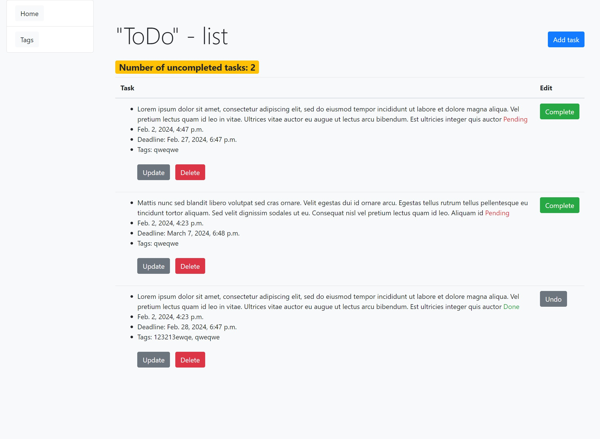
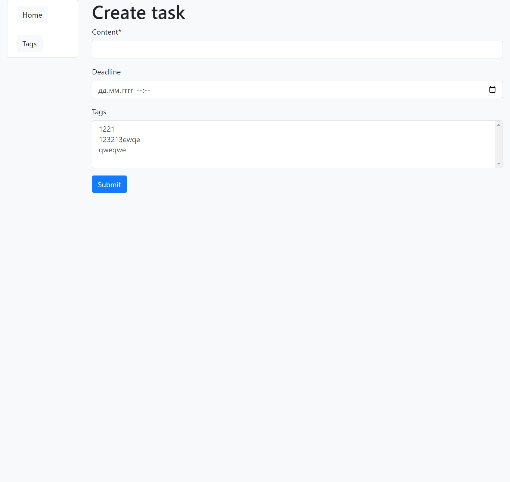
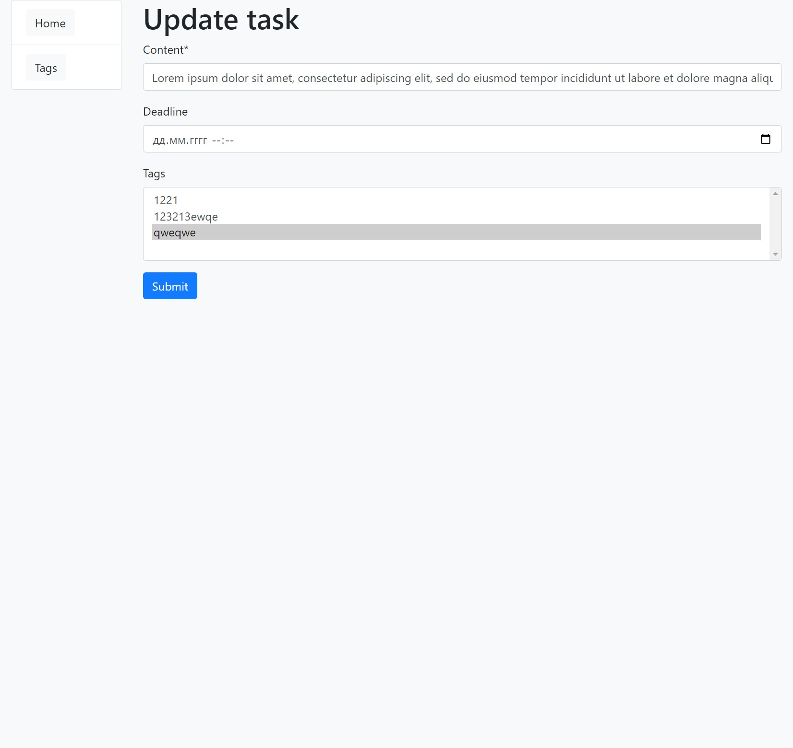
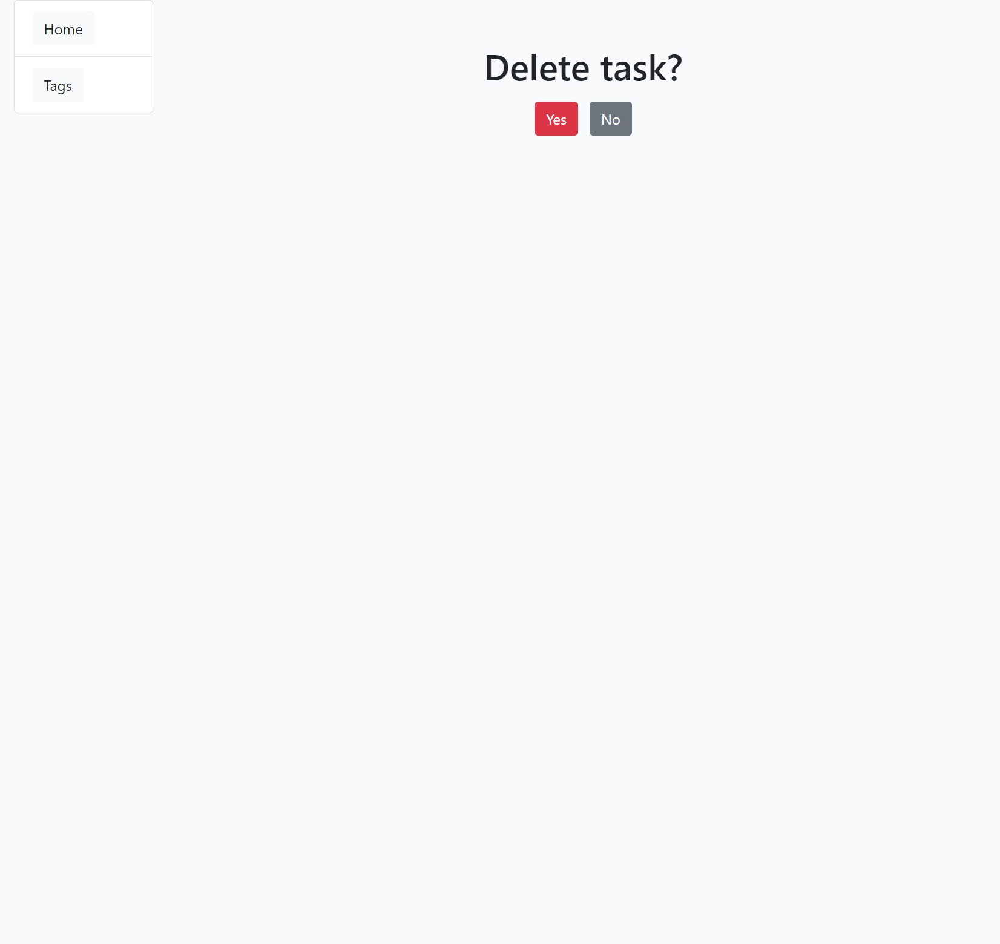
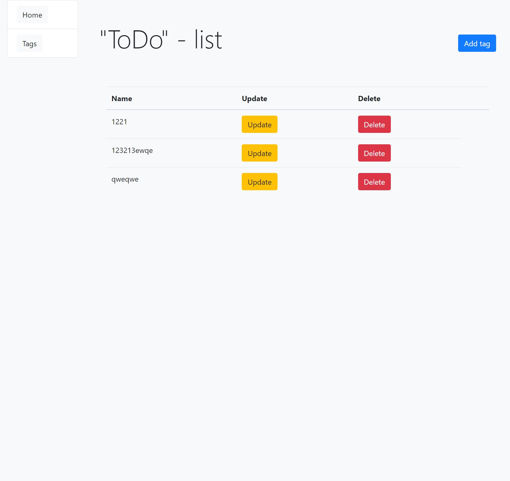
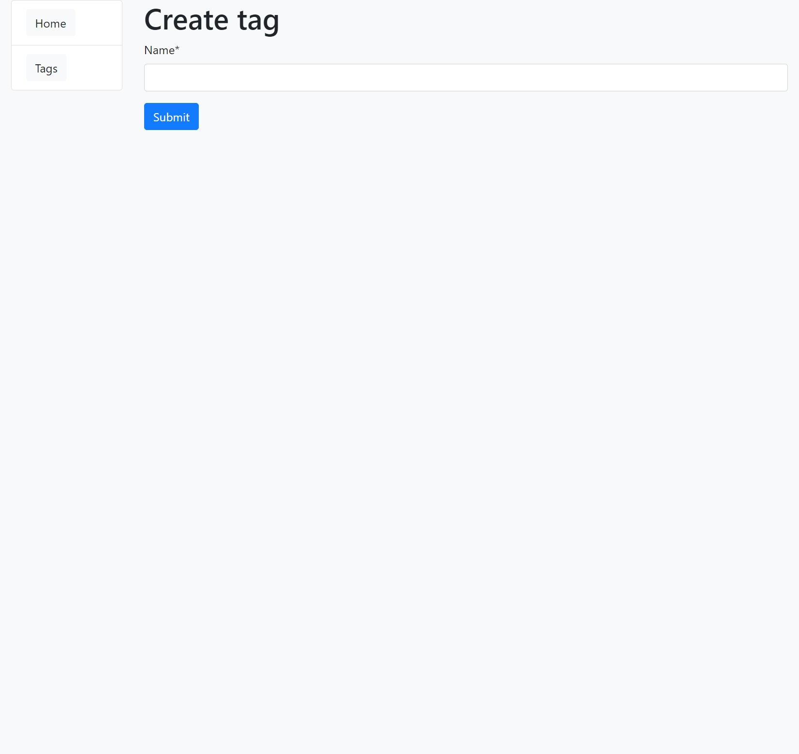

# ToDo-List

## Overview
This ToDo-List is a powerful task management tool designed to help users organize, track, and manage their tasks effectively. It provides a user-friendly interface to store, update, and delete tasks, ensuring a streamlined and efficient workflow.

## Key Features
- **Task Management:** Store and organize tasks with details such as title, description, due date, and completion status.
- **User-Friendly Interface:** Intuitive design for easy navigation and a seamless user experience.
- **Create New Tasks:** Add new tasks with relevant information to keep track of upcoming activities.
- **Update and Delete:** Modify task details or remove completed tasks to maintain an organized task list.
- **Tagging System:** Categorize tasks using tags for better organization and quick identification.
- **Statistics:** Get insights into your tasks with features like task count and completion statistics.
- **Responsive Design:** Access your ToDo-List seamlessly across various devices.

## Getting Started
1. Clone the repository.
2. Install dependencies using `pip install -r requirements.txt`.
3. Run the application with `python manage.py runserver`.
4. Access the ToDo-List at `http://127.0.0.1:8000/` in your browser.

## Usage
1. Visit the application homepage to view your task list.
2. Create new tasks with the "Add Task" feature, providing details such as title, description, and due date.
3. Update or delete tasks as needed using the corresponding buttons.
4. Utilize the tagging system to categorize tasks for better organization.
5. Monitor task completion statistics on the dashboard.

## Contributing
Contributions to the project are welcome. To contribute:
1. Fork the repository.
2. Create a new branch for your feature (`git checkout -b feature/YourFeature`).
3. Commit your changes (`git commit -m 'Add some feature'`).
4. Push to the branch (`git push origin feature/YourFeature`).
5. Open a pull request.

